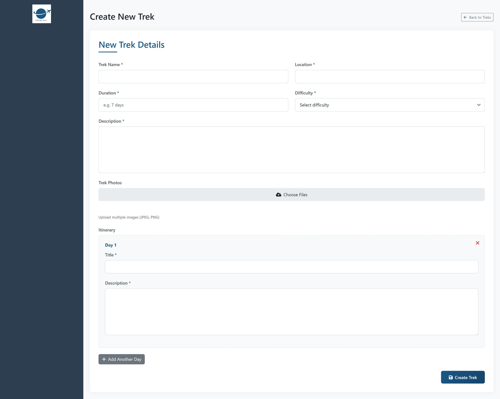
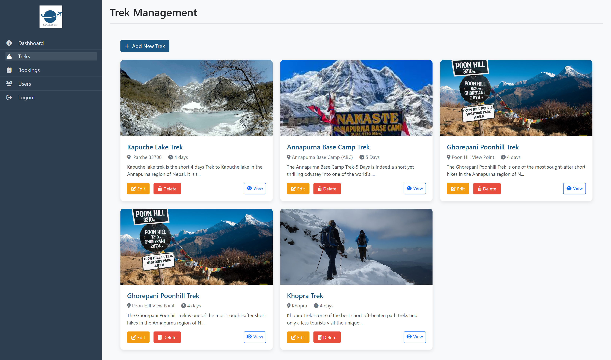

#  ExploreNest

**ExploreNest** is a full-stack web application designed for travelers and trekkers looking to explore Pokhara, Nepal. The platform provides detailed information on trekking routes and local activities, helping users plan their journey starting from Pokhara — the heart of tourism and adventure.

>  Built in just **3 days** during a hackathon that was part of a **1-week in-person bootcamp**, organized by **[Women Leaders in Technology (WLiT)](https://www.instagram.com/wlit_nepal/)** as a part of **6-month-long Fellowship Program**.

---

##  Tech Stack

### Frontend
- **EJS** – Templating engine for dynamic HTML rendering on the server
- **Bootstrap** – Responsive and mobile-first styling

### Backend
- **Node.js** – JavaScript runtime environment
- **Express.js** – Web framework for building the API and routes
- **Mongoose** – ODM for MongoDB
- **MongoDB** – NoSQL database to store trek, user, and admin data

---

##  Features

-  View trekking routes and detailed itineraries starting from Pokhara
-  Admin panel to add/update treks and activities

---

##  Screenshots

| Landing Page | Trek List | Trek Details |
|--------------|-----------|---------------|
|  |  |  |

| Admin Panel - Add Trek | Admin Panel |
|------------------------|-------------|
|  |  |

---

## Learnings & Challenges

- Our team initially faced communication gaps, which led to accidental data loss
- Encountered bugs related to Express.js routing and middleware handling
- With support from mentors, Google, and AI tools, we collaborated more efficiently and delivered the final product on time

---

## Team ExploreNest

-  **[Bijena Dhewaju](https://github.com/bijenadhewaju)**  
-  **[Bhumika Ojha](https://github.com/bhumikadidit)**
-  **[Arpana Khanal](https://github.com/arpana88)** 

---

## 📌 Note

This is an MVP version focusing on the **trekking itinerary and activities** section. Future plans include expanding to include hotel booking, transportation, and customizable trip planning.

---

##  Acknowledgment

Special thanks to **Women Leaders in Technology (WLiT)** for organizing the **bootcamp and hackathon** as part of the **6-month WLiT Fellowship**. Their mentorship and guidance were essential to the successful development of this project.

---
